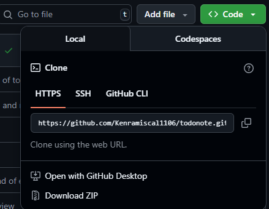

  

---

2DoNote, also known as Todonote is a to-do list app, inspired by Notion's default student planner template. It is a a task management website designed for students and professionals. It helps users create, organize, and track tasks while providing multiple ways to view the application.

## Installation and Development
To start hacking, you can click the "Download ZIP" button on the code dropdown:

or clone it using git.

If you are using VSCode as your code editor, it is recommended to download the [Live Preview VSCode Extension](https://marketplace.visualstudio.com/items?itemName=ms-vscode.live-server) to have the best DX 🔥🔥🔥

## 🔧 How we built it
2DoNote was built using vanilla JS, which is the **most performant** way of building web applications. Data is stored locally via [IndexedDB](https://developer.mozilla.org/en-US/docs/Web/API/IndexedDB_API), a low-level primitive of the browser that is performant, yet applicable to the use case of the application. Then, we used a function wrapper to perform operations in the database. When it comes to handling animations, the [Web Animations API](https://developer.mozilla.org/en-US/docs/Web/API/Web_Animations_API) to provide microinteractions, which are essential for providing user engagement. To give more elaboration, here are some of the Web APIs used by the application:

### IndexDB API

The JavaScript interface used to read/write that local task data. It allows to store tasks and user data locally in the browser for offline use and it was modelled to optimize how tasks, projects, and tags relate to each other for easier storage and retrieval.

### Drag and Drop API

Enables rearranging tasks, lists, or boards by dragging them with the mouse.

### Web Animations API

Adds smooth transitions (like sliding tasks or fading checkmarks) to improve user experience.

## 📃 Application features

### To-Do Item

- Clicking on the To-Do item will allow you to create more tasks and categorize them by category and due date.

### Calendar

- A table showing the due dates of each task visually through its location on the table.

### Kanban

- A feature where you can arrange and organize your tasks, through dragging.

### Toast

- It notifies the user of an update, such as the successful creation of a new task.

## ⚠️ Challenges we ran into
Despite the simplicity of the application, 2DoNote was not an easy project to build. Given that it does not use any Javascript or CSS frameworks, rendering and keeping track of changes in the database, as well as the website itself had proven itself tedious. Luckily, we utilized Web APIs that are [Baseline compatible](https://web.dev/baseline), giving us the best Developer Experience and enhancing performance for users. 

## 🏆 Accomplishments

Building 2DoNote in and of itself was already an accomplishment. It served as a learning project that helped us utilize the foundations of the web, particularly plain HTML, CSS, and JavaScript. In addition, it also made us realize how far we've learned for the past few years, giving us a benchmark of our present application level

## 💡 What we learned

In the production of 2DoNote, we learned that the process of making a usable site is more than just programming, it is programming with a purpose, programming for the improvement of the user's experience in using the site. Thinking in the position of the user, empathizing, is a key technique for making UI's and developing a site/application.

## 🔭 What's next for 2DoNote?

2DoNote served as a special project that helped us retain and recall the aspects learned in web development. Its existence has become for us a cornerstone of what we should apply to our future projects, and how we view web development as more than a job, but an art of skill mastery and application.